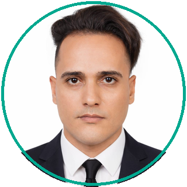

# Dr. Husam Salah Mahdi · د. حسام صلاح مهدي

**PhD, Computer Science Engineering · Acting Head of the AI Department, Al-Mustafa University**
**Medical AI & Arabic-first software — from DICOM to production.**

I build Arabic-first AI systems and medical software that actually run in production — radiology platforms, DICOM services, computer-vision deployments, legal-AI assistants, and university systems. I hold a **PhD in Computer Science Engineering** (Andhra University, 2026 — real-time UAV face recognition/segmentation with YOLOv8 + TensorRT) and lecture in AI at Al-Mustafa University, Baghdad, where I serve as **Acting Head of the AI Department**. I also train: most recently a 10-day **Python & AI for Medical Diagnostics** program for the Diagnostics Directorate of the Iraqi Ministry of Health.

## 🎓 Research

- **PhD thesis**: *Real-Time Face Recognition and Segmentation on UAVs: A YOLOv8–TensorRT Optimized Approach for Edge AI Acceleration* — published result: **4.28 ms/frame, 58% latency reduction** on edge hardware
- Mahdi, H. S., et al. (2025). *Accelerated real-time face recognition and segmentation with YOLOv8 optimized through TensorRT.* JISEM 10(35s). [doi:10.52783/jisem.v10i35s.5987](https://doi.org/10.52783/jisem.v10i35s.5987)
- Mahdi, H. S., et al. (2025). *Real-time drone communication system using ROS 2 and GStreamer with YOLOv8-Seg.* IJCESEN 11(2). [doi:10.22399/ijcesen.2123](https://doi.org/10.22399/ijcesen.2123)
- **Patent application** (India, 202541024396 A): *AI-Powered Cognitive System for Autonomous Drone Surveillance Using YOLOv8-Seg and GPU-Accelerated Edge Computing*

## 🩺 Flagship work

| Project | What it is | Status |
|---|---|---|
| **[RadBook](https://radbook.iqrad.doctor)** | Bilingual radiology workflow platform for Iraq — DICOM intake → signed reports → audited cash settlement. Next.js · NestJS · PostgreSQL | 🟢 Live in production |
| **[MoH Python & AI Course](https://drhusam-ai.hs-rp.com/course.html)** | 10-day training program for the Iraqi Ministry of Health — from the command line to training a YOLO blood-cell detector | ✅ Delivered Aug–Sep 2026 |
| **Iraqi ANPR (V1L-Ihub)** | Real-time Iraqi license-plate recognition — YOLOv11 (mAP50 0.868) + 4-engine Arabic OCR ensemble, deployed on a live camera at the University of Turath, Baghdad | 🟢 Field-deployed |
| **Al-Mustafa Smart University** | Arabic-first university ERP & smart campus — Flutter super-app, LMS, tamper-evident double-entry finance, fully self-hosted AI layer (vLLM · Whisper · VLM) | 🔒 Private |
| **[Iraqi Legal AI](https://github.com/husam05/final-iraqi-law)** | Arabic legal Q&A over ~620 Iraqi legal documents — hybrid BM25+FAISS retrieval, 5-agent pipeline with citation verification, runs fully offline on one GPU | 🌐 Public |
| **[3D Body Atlas](https://husam05.github.io/husam-body-atlas/Husam-3D.html)** | Offline bilingual 3D anatomy viewer with CT-derived surfaces and guided tour | 🟢 Live demo |
| **DICOM Licensing Server** | Central licence issuance & management for customer DICOM servers | 🟢 [Live](https://dicom.hs-rp.com) |
| **اطلب محامي (atlubmuhami)** | On-demand lawyer marketplace for Iraq — Flutter + NestJS monorepo, realtime chat, GPS matching | 🔒 v1.1.0 — Baghdad pilot |

## 🛠️ Stack

`Python` `TypeScript` `Go` `Dart/Flutter` · `YOLOv8/v11` `CRNN-OCR` `RAG/LLMs` `vLLM` `TensorFlow` · `Next.js` `NestJS` `React` `FastAPI` · `PostgreSQL` `MySQL` `Redis` · `Docker` `nginx` `systemd` `self-managed VPS` · `ROS 2` `TensorRT` `NVIDIA Jetson` `GStreamer`

## 🌱 Focus

- **Arabic-first**: user-facing products ship with full RTL Arabic UX as a first-class citizen
- **Self-hosted AI**: local LLMs, embeddings and vision models — designed to run without cloud APIs
- **Production over demos**: 8 systems currently live — 4 of them on self-managed VPS infrastructure (nginx · Docker · systemd)

**[→ Full portfolio: 46 documented works](https://drhusam-ai.hs-rp.com)**

